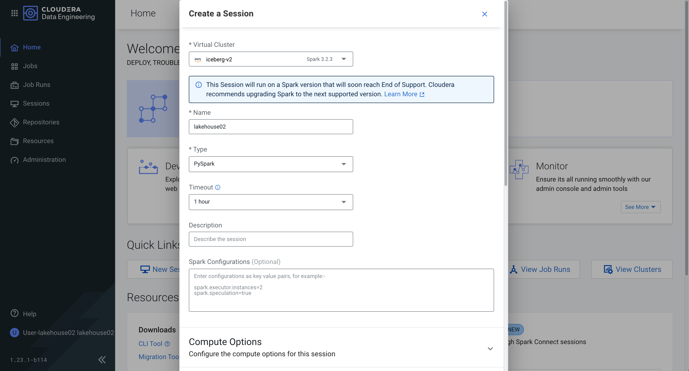

# Module 0 - Project Setup

## Orientation for Cloudera Data Warehouse

After login, you will be taken to the home screen of Cloudera. Some of you may be asked to "Try the new UI...". Make sure to click **Enable New UI**. From here you can access Cloudera Data Warehouse - one of its Data Services.

> **0a.** Click on the "Cloudera Data Warehouse" icon.


> **0b.** Then right-click on _Manage Data Warehouses_ and open it in a new tab.


If you are new to Cloudera Data Warehousing, take a moment to explore the dashboard.

Cloudera uses the concept of _Virtual Warehouses_ to setup isolated pods of compute to be able to run independent queries on underlying data. Each virtual warehouse can have multiple collaborators working on it and can scale up to workload demands. In the interest of time, a _hol-iceberg-hive-vw_ Virtual Warehouse has been created for all of you.

> **0c.** When ready click on the "Hue" button for the Hive Virtual Warehouse:


Once the Hue UI loads, copy the script below and paste it in the Query Window. You will need to enter the following variables:

- **Prefix**: `lhxx` (Use your own user ID instead of "xx")
- **Bucket Name**: `hol-iceberg-buk-ed8eec76/iceberg-hott`

**Note:** This script may take a few minutes to run.


```
-- CREATE DATABASES
CREATE DATABASE ${prefix}_airlines_csv;
CREATE DATABASE ${prefix}_airlines;
-- CREATE CSV TABLES
drop table if exists ${prefix}_airlines_csv.flights_csv;
CREATE EXTERNAL TABLE ${prefix}_airlines_csv.flights_csv (
month int, dayofmonth int, dayofweek int, deptime int, crsdeptime int,
arrtime int, crsarrtime int, uniquecarrier string, flightnum int, tailnum string,
actualelapsedtime int, crselapsedtime int, airtime int, arrdelay int, depdelay int,
origin string, dest string, distance int, taxiin int, taxiout int,
cancelled int, cancellationcode string, diverted string,
carrierdelay int, weatherdelay int, nasdelay int, securitydelay int, lateaircraftdelay int,
year int
)
ROW FORMAT DELIMITED FIELDS TERMINATED BY ',' LINES TERMINATED BY '\n'
STORED AS TEXTFILE LOCATION 's3a://${cdp_env_bucket}/airlines-csv/flights'
tblproperties("skip.header.line.count"="1");
drop table if exists ${prefix}_airlines_csv.planes_csv;
CREATE EXTERNAL TABLE ${prefix}_airlines_csv.planes_csv (
tailnum string, owner_type string, manufacturer string, issue_date string,
model string, status string, aircraft_type string, engine_type string, year int
)
ROW FORMAT DELIMITED FIELDS TERMINATED BY ',' LINES TERMINATED BY '\n'
STORED AS TEXTFILE LOCATION 's3a://${cdp_env_bucket}/airlines-csv/planes'
tblproperties("skip.header.line.count"="1");
drop table if exists ${prefix}_airlines_csv.airlines_csv;
CREATE EXTERNAL TABLE ${prefix}_airlines_csv.airlines_csv (
code string, description string
)
ROW FORMAT DELIMITED FIELDS TERMINATED BY ',' LINES TERMINATED BY '\n'
STORED AS TEXTFILE LOCATION 's3a://${cdp_env_bucket}/airlines-csv/airlines/'
tblproperties("skip.header.line.count"="1");
drop table if exists ${prefix}_airlines_csv. airports_csv;
CREATE EXTERNAL TABLE ${prefix}_airlines_csv.airports_csv (
iata string, airport string, city string, state DOUBLE, country string, 
lat DOUBLE, lon DOUBLE
)
ROW FORMAT DELIMITED FIELDS TERMINATED BY ',' LINES TERMINATED BY '\n'
STORED AS TEXTFILE LOCATION 's3a://${cdp_env_bucket}/airlines-csv/airports'
tblproperties("skip.header.line.count"="1");
drop table if exists ${prefix}_airlines_csv.unique_tickets_csv;
CREATE external TABLE ${prefix}_airlines_csv.unique_tickets_csv (
ticketnumber BIGINT, leg1flightnum BIGINT, leg1uniquecarrier STRING,
leg1origin STRING, leg1dest STRING, leg1month BIGINT, leg1dayofmonth BIGINT,
leg1dayofweek BIGINT, leg1deptime BIGINT, leg1arrtime BIGINT,
leg2flightnum BIGINT, leg2uniquecarrier STRING, leg2origin STRING,
leg2dest STRING, leg2month BIGINT, leg2dayofmonth BIGINT, leg2dayofweek BIGINT,
leg2deptime BIGINT, leg2arrtime BIGINT
)
ROW FORMAT DELIMITED FIELDS TERMINATED BY ',' LINES TERMINATED BY '\n'
STORED AS TEXTFILE LOCATION 's3a://${cdp_env_bucket}/airlines-csv/unique_tickets'
tblproperties("skip.header.line.count"="1");
-- CREATE HIVE TABLE FORMAT STORED AS PARQUET
drop table if exists ${prefix}_airlines.planes;
CREATE EXTERNAL TABLE ${prefix}_airlines.planes (
tailnum STRING, owner_type STRING, manufacturer STRING, issue_date STRING,
model STRING, status STRING, aircraft_type STRING, engine_type STRING, year INT
)
STORED AS PARQUET
TBLPROPERTIES ('external.table.purge'='true')
;
INSERT INTO ${prefix}_airlines.planes
SELECT * FROM ${prefix}_airlines_csv.planes_csv;
drop table if exists ${prefix}_airlines.unique_tickets;
CREATE EXTERNAL TABLE ${prefix}_airlines.unique_tickets (
ticketnumber BIGINT, leg1flightnum BIGINT, leg1uniquecarrier STRING,
leg1origin STRING, leg1dest STRING, leg1month BIGINT,
leg1dayofmonth BIGINT, leg1dayofweek BIGINT, leg1deptime BIGINT,
leg1arrtime BIGINT, leg2flightnum BIGINT, leg2uniquecarrier STRING,
leg2origin STRING, leg2dest STRING, leg2month BIGINT, leg2dayofmonth BIGINT,
leg2dayofweek BIGINT, leg2deptime BIGINT, leg2arrtime BIGINT
)
STORED AS PARQUET
TBLPROPERTIES ('external.table.purge'='true');
INSERT INTO ${prefix}_airlines.unique_tickets
SELECT * FROM ${prefix}_airlines_csv.unique_tickets_csv;
-- CREATE ICEBERG TABLE FORMAT STORED AS PARQUET
drop table if exists ${prefix}_airlines.flights_iceberg;
CREATE EXTERNAL TABLE ${prefix}_airlines.flights_iceberg (
month int, dayofmonth int,
dayofweek int, deptime int, crsdeptime int, arrtime int,
crsarrtime int, uniquecarrier string, flightnum int, tailnum string,
actualelapsedtime int, crselapsedtime int, airtime int, arrdelay int,
depdelay int, origin string, dest string, distance int, taxiin int,
taxiout int, cancelled int, cancellationcode string, diverted string,
carrierdelay int, weatherdelay int, nasdelay int, securitydelay int,
lateaircraftdelay int
)
PARTITIONED BY (year int)
STORED BY ICEBERG
STORED AS PARQUET
TBLPROPERTIES ('external.table.purge'='true')
;
-- LOAD DATA INTO ICEBERG TABLE FORMAT STORED AS PARQUET
INSERT INTO ${prefix}_airlines.flights_iceberg
SELECT * FROM ${prefix}_airlines_csv.flights_csv
WHERE year <= 2006;
```

- Execute the following in HUE using the Hive VW to test that data has loaded correctly

  - Copy & paste the SQL below into HUE, in the “prefix” parameter box enter your user id

```
-- TEST FLIGHTS CSV TABLE
SELECT COUNT(*) FROM ${prefix}_airlines_csv.flights_csv;
```

Ensure that correct count is being returned

- Copy & paste the SQL below into HUE, in the “prefix” parameter box enter your user id

```
-- TEST PLANES CSV TABLE
SELECT COUNT(*) FROM ${prefix}_airlines_csv.planes_csv;
```

- Copy & paste the SQL below into HUE, in the “prefix” parameter box enter your user id

```
-- TEST PLANES PROPERTIES
DESCRIBE FORMATTED ${prefix}_airlines.planes;
```

Pay attention to the following properties: Table Type, SerDe Library, and Location

- Copy & paste the SQL below into HUE, in the “prefix” parameter box enter your user id

```
-- TEST PLANES PARQUET TABLE
SELECT * FROM ${prefix}_airlines.planes LIMIT 10;
```

Ensure records are being returned, tailnum should not be null, but other columns are empty or null

## Orientation for Cloudera Data Engineering

While the script above is running, you can go ahead and set up a Spark session. 

From the other Cloudera tab you have open, navigate to Cloudera Data Engineering.


You will have then arrived in the Cloudera Data Engineering homepage. Take a minute to get familiar with it.


Next, click on new Session. You will see the UI below come up. Go ahead and create a session with the `iceberg-v2` Virtual Cluster. Keep the timeout to 1 hour and the type as PySpark. 



Note: You will need to click on _Compute Options_ and select the number of executors, memory and cores per executor, etc. See the screenshot below for the sizing and make sure to follow it exactly. 


Leave all other settings as is and Create a Session. 

Now, navigate back to the tab with the Hue script we had running. We will now start with the lab.

## Next Steps

To continue, select the following module:

- [Module 01 - Table Migration](../1_Table_Migration/README.md)

