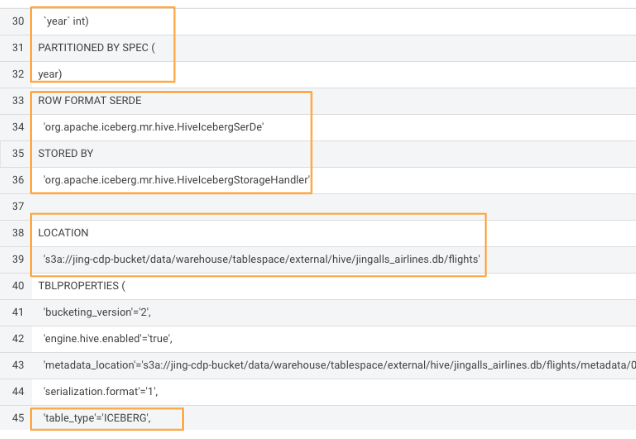

# Create Iceberg Table Feature

## Overview

This submodule guides you through the process of creating a partitioned Iceberg table on the Cloudera Data Platform (CDP) using SQL commands. Iceberg tables offer efficient data management and are ideal for large datasets that require schema evolution and partitioning capabilities.

## Prerequisites

Before starting, ensure you have:

- Access to Cloudera Data Warehouse (CDW) HUE.
- Proper permissions to execute SQL commands in the Hive Virtual Warehouse (VW).
- Your `${prefix}` (e.g., your User ID) ready for use in the queries.

## Step-by-Step Guide

### Step 1: Drop the Existing Table (if necessary)

Before creating a new Iceberg table, you may need to drop an existing table with the same name to avoid conflicts.

``` sql
DROP TABLE IF EXISTS ${prefix}_airlines.flights;
```

### Step 2: Create the Iceberg Table

Next, execute the following SQL command to create a new partitioned Iceberg table named `flights`. This table will be partitioned by the `year` column and stored in Parquet format.

``` sql
CREATE EXTERNAL TABLE ${prefix}_airlines.flights (
    month int, 
    dayofmonth int,
    dayofweek int, 
    deptime int, 
    crsdeptime int, 
    arrtime int,
    crsarrtime int, 
    uniquecarrier string, 
    flightnum int, 
    tailnum string,
    actualelapsedtime int, 
    crselapsedtime int, 
    airtime int, 
    arrdelay int,
    depdelay int, 
    origin string, 
    dest string, 
    distance int, 
    taxiin int,
    taxiout int, 
    cancelled int, 
    cancellationcode string, 
    diverted string,
    carrierdelay int, 
    weatherdelay int, 
    nasdelay int, 
    securitydelay int,
    lateaircraftdelay int
)
PARTITIONED BY (year int)
STORED BY ICEBERG
TBLPROPERTIES ('external.table.purge'='true');
```

### Step 3: Verify the Table Creation

After creating the table, it’s important to verify that the table has been created with the correct schema and properties. Run the following command to see the table's creation details:

``` sql
SHOW CREATE TABLE ${prefix}_airlines.flights;
```

**Note:** In the output, look for the correct partitioning by `year` and ensure that the table is stored using the Iceberg format with the appropriate properties.



### Summary

You have successfully created a partitioned Iceberg table in CDP using SQL. This table is now ready to be populated with data and utilized for efficient querying and data management.

## Next Steps

To continue, select the following module:

- [Module 03 - Loading Data](../3_Loading_Data/README.md)

