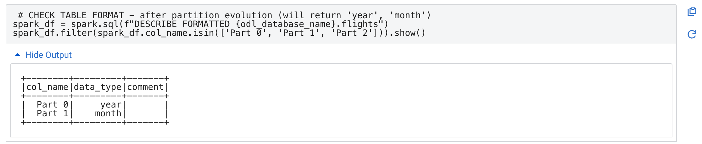

# Partition Evolution Using SparkSQL

## Overview

In this submodule, we’ll explore in-place partition evolution using SparkSQL within a Cloudera Data Engineering (CDE) session. Partition evolution allows you to modify the partitioning strategy of your tables with minimal data movement, improving performance and scalability.

## Prerequisites

Before starting, ensure you have:

- Access to a Cloudera Data Engineering (CDE) session.
- Proper permissions to execute SparkSQL commands.
- Your `${prefix}` (e.g., your User ID) ready for use in the code.

## Step-by-Step Guide

### Step 1: Set Up Variables

Begin by setting up your environment variables. Replace `<prefix>` with your unique value (e.g., your User ID).

``` python
# Variables - replace <prefix> with your user id
prefix = "<prefix>"
csv_database_name = prefix + "_airlines_csv"
odl_database_name = prefix + "_airlines"
```

### Step 2: Check Current Partitioning

Before evolving the partition, check the current partitioning strategy of the `flights` table. This will confirm that the table is currently partitioned by year.

``` python
# CHECK TABLE FORMAT - before in-place partition evolution (will return 'year')
spark_df = spark.sql(f"DESCRIBE FORMATTED {odl_database_name}.flights")
spark_df.filter(spark_df.col_name.isin(['Part 0', 'Part 1', 'Part 2'])).show()
```

### Step 3: Evolve the Partition In-Place

Use the `ALTER TABLE` command to add another column (`month`) to the partitioning strategy, improving performance without moving any existing data.

``` python
# EVOLVE PARTITION IN-PLACE - add another column to partition to improve performance
spark.sql(f"ALTER TABLE {odl_database_name}.flights ADD PARTITION FIELD month").show()
```

**Note**: This ALTER TABLE operation happens in-place, so no data is manipulated, and the existing data remains indexed by year.

### Step 4: Verify the New Partitioning

After evolving the partition, verify that the table is now partitioned by both year and month.

``` python
# CHECK TABLE FORMAT - after partition evolution (will return 'year', 'month')
spark_df = spark.sql(f"DESCRIBE FORMATTED {odl_database_name}.flights")
spark_df.filter(spark_df.col_name.isin(['Part 0', 'Part 1', 'Part 2'])).show()
```

**Note**: In the output, look for the Partition Spec to confirm the table is now partitioned by year and month.



### Step 5: Load Additional Data

Load additional data into the `flights` table to take advantage of the new partitioning strategy.

``` python
# LOAD ANOTHER YEAR OF DATA USING NEW PARTITION
spark.sql(f"INSERT INTO {odl_database_name}.flights SELECT * FROM {csv_database_name}.flights_csv WHERE year = 2007").show()
```

Query to see that the data for 2007 was loaded successfully.

``` python
# Query Data grouped by Year
spark.sql(f"SELECT year, count(*) FROM {odl_database_name}.flights GROUP BY year ORDER BY year desc").show()
```

### Step 6: Query the Iceberg Table Using Impala

Switch to Hive to query the Iceberg table and analyze the benefits of the new partitioning strategy.

1. First, run the following query to analyze the data for the year 2006 (which uses the original year-only partition). Notice how long the query takes.

``` sql
-- 2006 Query
SELECT year, month, count(*)
FROM ${prefix}_airlines.flights
WHERE year = 2006 AND month = 12
GROUP BY year, month
ORDER BY year desc, month asc;
```

2. Next, run the following query to analyze the data for the year 2007 (which uses the new year and month partition).

``` sql
-- RUN THIS QUERY AND COMPARE RESULTS
SELECT year, month, count(*)
FROM ${prefix}_airlines.flights
WHERE year = 2007 AND month = 12
GROUP BY year, month
ORDER BY year desc, month asc;
```

### Summary

You have successfully evolved the partitions of your Iceberg table in-place using SparkSQL and demonstrated the performance benefits of optimized partitioning with Hive. This process allows you to maintain scalability and performance as your data evolves.

## Next Steps

To further explore partition evolution and Iceberg's capabilities, consider the following:

- **[Module 05 - Time Travel](../5_Time_Travel/README.md):** If you're interested in leveraging Iceberg's time travel capabilities to query historical data, this module will be a great next step.

These submodules and modules will help you build on the foundational knowledge you've gained and explore more advanced capabilities of Iceberg tables.
