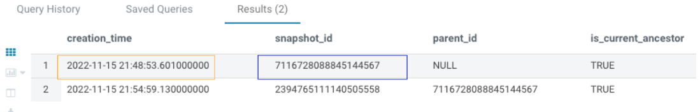
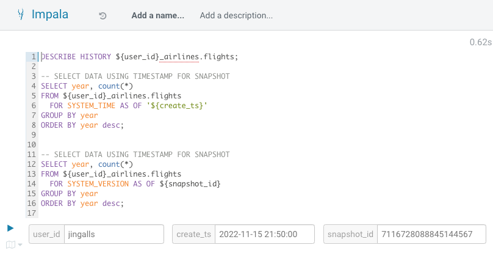
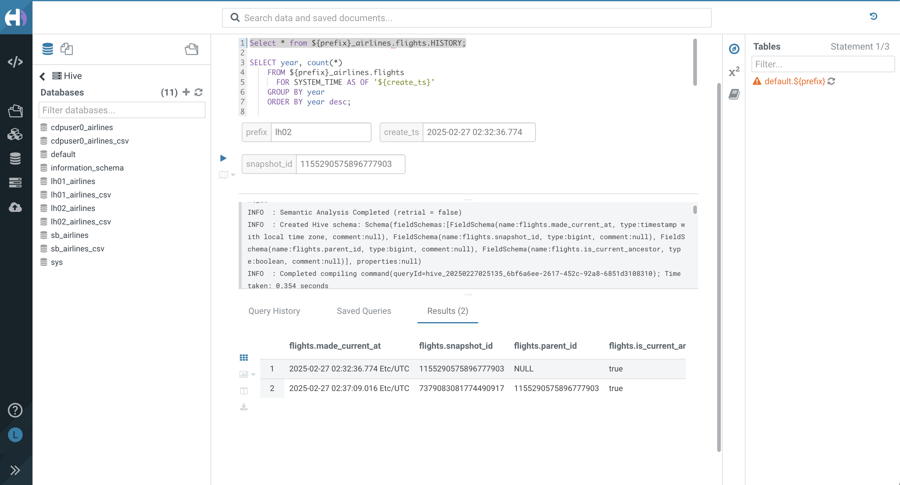

# Time Travel Using SQL

## Overview

In the previous steps, we have been loading data into the `flights` Iceberg table. Each time we add, delete, or update data, a snapshot is captured. This ensures eventual consistency and allows for multiple reads/writes concurrently from various engines. In this submodule, we will leverage the **Time Travel** feature to query data from a specific point in time. A common use case for this feature is regulatory compliance.

## Step-by-Step Guide

### Step 1: Execute Time Travel Queries

In the following steps, execute these commands in Hue for Hive VW:

```sql
    SELECT * FROM ${prefix}_airlines.flights.HISTORY;
```

### Step 2: Describe the History of the Iceberg Table

- Highlight and execute the History table query line to return all available snapshots for the `flights` Iceberg table.
- Each snapshot captures the table state at different times when data was added or updated.

	

### Step 3: Select a Snapshot Timestamp

- In the `create_ts` parameter box, enter a date/time (either relative or specific timestamp). For example, use `2025-02-27 02:34:36.774` to select a time between the two snapshots.

### Step 4: Select a Snapshot ID

- In the `snapshot_id` parameter box, enter the snapshot ID number from the blue box under `snapshot_id`. In this example, it is `1155290575896777903`.

	

### Step 5: Query Data for a Specific Timestamp

```sql
    -- SELECT DATA USING TIMESTAMP FOR SNAPSHOT
    SELECT year, count(*) 
    FROM ${prefix}_airlines.flights
      FOR SYSTEM_TIME AS OF '${create_ts}'
    GROUP BY year
    ORDER BY year desc;
```

- Highlight and execute the query with `FOR SYSTEM_TIME AS OF`. You can use either a specific timestamp or a relative timestamp. Iceberg will query the snapshot that was in effect as of the specified time.

	

### Step 6: Query Data for a Specific Snapshot ID

```sql
    -- SELECT DATA USING SNAPSHOT ID
    SELECT year, count(*) 
    FROM ${prefix}_airlines.flights
      FOR SYSTEM_VERSION AS OF ${snapshot_id}
    GROUP BY year
    ORDER BY year desc;
```
- Highlight and execute the query with `FOR SYSTEM_VERSION AS OF` to use the specific snapshot ID.

## Summary

In this submodule, you learned how to use Iceberg’s **Time Travel** feature in CDP’s Hive interface to query historical data using both timestamps and snapshot IDs. These features allow you to see the state of your data at any specific point in time, which is valuable for regulatory compliance or auditing.

## Next Steps

To continue exploring Iceberg, proceed to the next module:

- `06` [Branching and Tagging](../6_Branching_and_Tagging//README.md)
