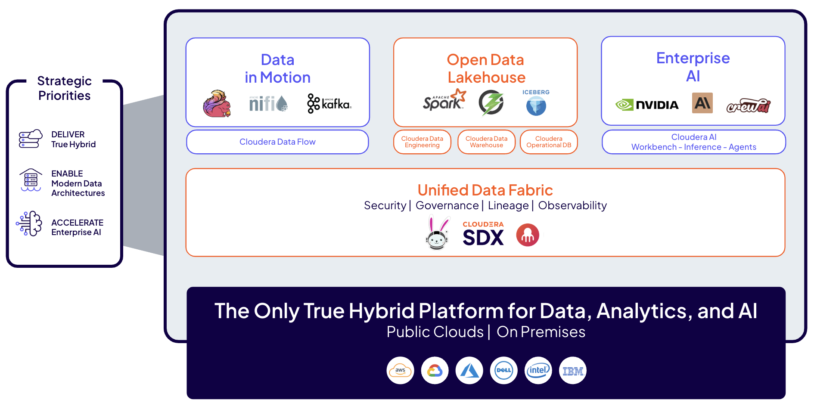

# Open Data Lakehouse with Apache Iceberg

### Welcome to our Lakehouse Hands-on-Lab!

The goal of this hands-on-lab is to explore Cloudera's Open Data Lakehouse capabilities. Powered by Apache Iceberg, Cloudera brings robust structured and unstructured data management capabilities across Cloud and On-Prem environments. With Iceberg support in all our compute engines (NiFi, Flink, Spark, Hive, Impala, Trino, and Cloudera AI), Cloudera's Open Data Lakehouse provides the widest range of options to work with Apache Iceberg, and ensures that every workload has the right engine to go with it.

## Lab Flow

In this lab, you will interact with Iceberg through different query engines such as Hive, Impala and Spark. You will learn how to load data with Iceberg, migrate Hive tables, and explore next-gen features such as Partition Evolution, Time Travel, Branching and Tagging. We will wrap up with a quick demo of our REST Catalog capabilities, and see how we can connect to Iceberg from external engines such as AWS Athena.

There are currently 6 exercises in the lab. It is important to follow the exercise order, as there are dependencies between different stages. 
  - [0. Getting Setup with Cloudera](0_Cloudera_Orientation/README.md)
  - [1. Table Migration](1_Table_Migration/README.md)
  - [2. Creating Tables](2_Creating_Tables/README.md)
  - [3. Loading Data](3_Loading_Data/README.md)
  - [4. Partition Evolution](4_Partition_Evolution/README.md)
  - [5. Time Travel](5_Time_Travel/README.md)
  - [6. Branching & Tagging](6_Branching_and_Tagging/README.md)